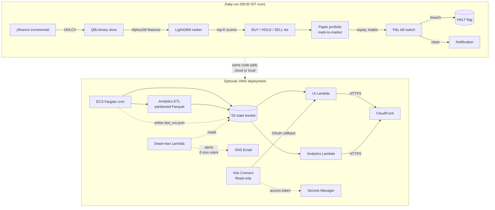

# nse-quant

A production-grade Indian-equity cross-sectional ranking strategy. Pulls
NSE+BSE daily OHLCV via yfinance, builds Alpha158 features in Microsoft's
[Qlib](https://github.com/microsoft/qlib), trains a LightGBM ranker, emits a
daily BUY / HOLD / SELL list, marks a paper portfolio to market, and runs
safety rails (kill switches, data-quality gates, dead-man's switch).

**No deep learning. No GPU. No transformer.** This is the production fork of an
earlier experiment that A/B-tested a transformer foundation model (Kronos) as
an additional feature; it lost on RankIC, Sharpe, and turnover. The simpler
LightGBM stack is what's here.

This repo is intentionally end-to-end runnable: clone, install, follow the
quick-start, and within ~10 minutes you have a paper portfolio updating daily.

---

## Architecture



The same Python code runs locally (one cron line) or in AWS (CDK-deployed ECS
Fargate task on a CloudWatch schedule). Choose your deployment based on whether
you want a colleague-friendly dashboard at a public URL.

---

## How the model works (60 seconds)

| Decision | Choice | Why |
|---|---|---|
| Universe | NIFTY Total Market 750 (NIFTY 500 + Microcap 250) | Bigger ⇒ more cross-sectional signal; capped at 750 to stay retail-tradeable |
| Features | Alpha158 (Qlib's 158-dim handcrafted set) | Battle-tested, no learned-features risk |
| Model | LightGBM ranker (`qlib.contrib.model.gbdt.LGBModel`) | Ranks stocks against each other; fast to retrain monthly |
| Rebalance | 5 trading days | Daily was tested — overtrades into noise |
| Top-K | 30 | Smallest K where idiosyncratic risk is dominated by the alpha |
| Costs | 15 bps buy + 25 bps sell (flat) | Roughly correct at ₹5Cr+ AUM; conservative for retail |

Honest evaluation lives in `examples/nse_walkforward_backtest.py` — 8 rolling
annual windows, t-stat against zero. **Walk-forward t-stat = 3.79** is the
load-bearing claim. Headline backtest numbers (+31% excess) are inflated by
survivorship and a 2024-2026 bull regime; the honest forward expectation is
**+8-15% / year, Sharpe 0.7-1.2**.

---

## Quick start (local)

```bash
# 1. Clone
git clone https://github.com/parvez301/nse-quant.git
cd nse-quant

# 2. Set up Python env (Python 3.11+ recommended)
python3 -m venv .venv
source .venv/bin/activate
pip install -r requirements.txt

# 3. One-time: build the price database (~30 min, ~300MB)
python examples/nse_data_loader.py --start 2010-01-01

# 4. One-time: build the point-in-time universe cache
python examples/nse_universe_pit.py build

# 5. Train the ranker (~5 min)
python examples/nse_baseline.py --out_dir outputs/nse_baseline_750_long

# 6. Generate today's BUY list
python examples/nse_daily_decision.py \
  --model_dir outputs/nse_baseline_750_long --topk 30
# → outputs/decisions/YYYY-MM-DD.{json,txt}

# 7. Initialize a paper portfolio and mark to market
python examples/nse_paper_trade.py execute YYYY-MM-DD
python examples/nse_paper_trade.py mark
python examples/nse_paper_trade.py report
```

To put this on a daily cron (Mon–Fri, 08:00 IST, before NSE opens at 09:15):

```bash
crontab -e
# Add:
0 8 * * 1-5 cd <path-to-repo> && ./examples/run_daily.sh
```

---

## What's in `examples/`

| Script | Purpose |
|---|---|
| `nse_data_loader.py` | yfinance → Qlib binary; supports `--incremental` for cron |
| `nse_universe_pit.py` | Build the point-in-time listed-universe cache |
| `nse_baseline.py` | Train Alpha158 + LightGBM ranker; write model + headline |
| `nse_daily_decision.py` | Generate today's top-K BUY list, with liquidity filter |
| `nse_paper_trade.py` | `execute` / `mark` / `report` for the paper portfolio |
| `nse_walkforward.py` | Production refit helper (run monthly) |
| `nse_walkforward_backtest.py` | Honest evaluation: N rolling annual test windows |
| `nse_pit_evaluate.py` | Re-run an existing model with the PIT mask |
| `nse_slippage_model.py` | ADV-aware slippage simulator (replaces flat Qlib costs) |
| `nse_safety.py` | HALT flag, P&L kill switch, data-quality gate, macOS notifier |
| `nse_ic_monitor.py` | Live information-coefficient tracker |
| `nse_kite_check.py` | Read-only Zerodha Kite Connect smoke test |
| `nse_export_analytics.py` | ETL: write partitioned Parquet for the dashboard |
| `nse_export_features_today.py` | ETL: today's Alpha158 features for SHAP attribution |
| `nse_cost_sensitivity.py` | Sweep cost assumptions; report Sharpe sensitivity |
| `nse_outage_monte_carlo.py` | Simulate cron-outage scenarios |
| `nse_stratified_stats.py` | Per-cap-bucket performance breakdown |
| `nse_survivorship_estimate.py` | Estimate the survivorship-bias gap |
| `run_daily.sh` | Cron entry point — runs the full daily pipeline |

---

## Cloud deployment (optional)

If you want the dashboard at a public URL, deploy the AWS stack:

```bash
# 1. Configure AWS credentials for an account you control
#    (per-machine — keep out of git; .envrc.local is gitignored)
echo 'export AWS_PROFILE=your-profile' > .envrc.local
source ./activate.sh

# 2. CDK setup (one-time)
make setup
make bootstrap NOTIFICATION_EMAIL=you@example.com

# 3. Deploy without a custom domain (raw Lambda Function URL)
make deploy NOTIFICATION_EMAIL=you@example.com

# 3b. Or deploy with a custom domain (CloudFront + ACM + Route53)
cd infra && cdk deploy \
  -c notification_email=you@example.com \
  -c custom_domain=trade.example.com \
  -c hosted_zone_id=Z0123456789ABCDEFGHIJ \
  -c hosted_zone_name=example.com
```

The stack provisions:

- **Daily ECS Fargate task** (CloudWatch Events trigger) running `run_daily.sh`
- **State S3 bucket** for outputs (decisions, equity curve, model, analytics)
- **UI Lambda** serving the dashboard at `/`
- **Analytics Lambda** serving `/api/analytics/*` (SHAP attribution, OHLC charts)
- **CloudFront** in front of both, with an ACM cert if you set the domain
- **Dead-man's switch Lambda** that emails via SNS if the cron didn't run
- **Secrets Manager entry** `nse-quant/kite` for Zerodha Kite Connect credentials
- **OAuth callback routes** in the UI Lambda for Kite read-only access

A run takes ~3–4 minutes end-to-end. Cost is roughly **$3–5/month** at idle —
the ECS task is on-demand (not always-on), Lambdas are pay-per-invoke, S3 holds
< 1 GB.

---

## Honesty checklist before going live

- [ ] Run walk-forward backtest (`nse_walkforward_backtest.py`); confirm
      Sharpe t-stat > 2 across windows.
- [ ] Run PIT evaluator (`nse_pit_evaluate.py`); confirm gap is < 5% of headline.
- [ ] Run slippage capital sweep (`nse_slippage_model.py --sweep_capital ...`);
      confirm Sharpe stays > 0.5 at your real AUM.
- [ ] **Paper-trade for 90 days.** Confirm live IC tracks backtest IC within 0.02.
- [ ] Verify the kill-switch fires on synthetic loss events.
- [ ] Only THEN consider real money.

The repo deliberately ships **no order-placement code**. Kite Connect
integration is OAuth + read-only (profile / margins / holdings). Live trading
needs another commit and another author to take responsibility for it.

---

## Known gaps

- **Partial point-in-time fix.** `nse_universe_pit.py` filters by listing date,
  but yfinance silently drops fully-delisted tickers. A true survivorship fix
  needs paid data (~$30/mo from EOD Historical Data, or ~₹15K/yr from Trendlyne).
- **No NSE-specific corporate-action handling** beyond what yfinance already
  applies. Splits and bonuses are handled; rights issues and demergers may
  introduce noise.
- **No live broker integration.** Paper-trade only. By design.
- **2024-2026 outliers** in walk-forward (post-COVID dispersion regimes) inflate
  the headline mean. The median is a better point estimate.

See `docs/nightly_report.md` for the long-form context, including the original
Kronos A/B comparison.

---

## License

MIT. Use at your own risk; this is research code, not financial advice.
